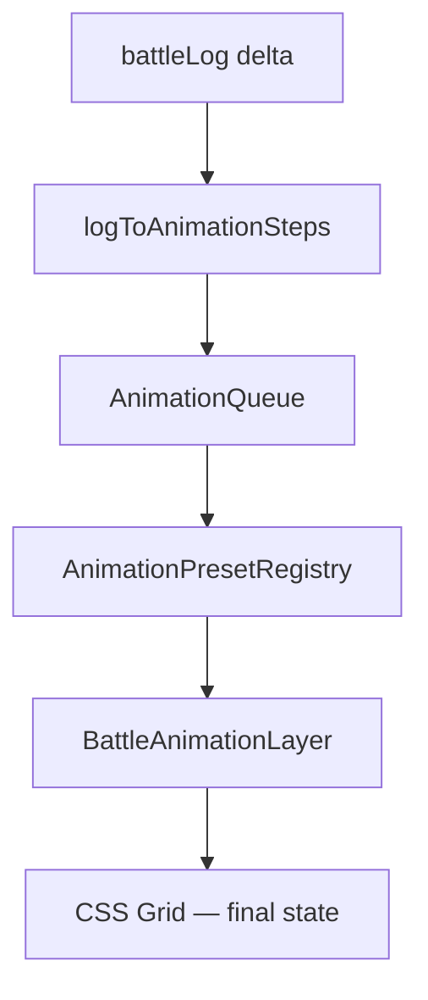

# Базовые анимации боя

**Дата:** 2026-07-17  
**Статус:** утверждено к реализации  
**Связь:** `AGENTS.md`, `2026-06-22-battle-field-ui-design.md`, `2026-03-28-battle-log-ui-design.md`, `src/features/battle/BattleScreen.tsx`, `src/game/battle/reducer.ts`, `src/game/types.ts` (`BattleLogEntry`)

---

## 1. Цель

Добавить **универсальные косметические анимации** тактического боя поверх текущего мгновенного reducer + React-рендера:

| Категория | Пресеты |
|-----------|---------|
| Перемещение | Move, Teleport |
| Атака | Strike (melee), Projectile (ranged), Cast (0 dmg), AoE Burst |
| Поддержка | Heal, Resurrect |
| Статусы | BuffAura, DebuffAura, StatusTick |
| Исход | Death |
| Будущее (Phase 2) | ProcSparkle |

**Решения заказчика (brainstorming):**

- **B — косметика:** reducer применяет состояние сразу; анимации — overlay, не блокируют логику.
- **A — полная длительность:** и ходы игрока, и AI проигрывают все пресеты с одинаковыми таймингами (без ускорения для AI).
- Visual queue сериализует проигрывание, чтобы при быстром AI эффекты не наслаивались хаотично.

---

## 2. Архитектурный подход

### 2.1. DECIDED: Presentation layer + registry (без новых npm-зависимостей)



| Слой | Файл | Ответственность |
|------|------|-----------------|
| Типы шагов | `src/features/battle/animation/types.ts` | Discriminated union `AnimationStep` |
| Маппинг log → steps | `src/features/battle/animation/logToSteps.ts` | Чистые функции, тестируемые |
| Классификация статусов | `src/features/battle/animation/statusAuraMap.ts` | `statusKind` → `buff` \| `debuff` |
| Реестр пресетов | `src/features/battle/animation/presetRegistry.ts` | id, duration, coalesce rules |
| Очередь | `src/features/battle/animation/useBattleAnimationQueue.ts` | drain, reduced-motion, cleanup |
| Координаты | `src/features/battle/animation/cellGeometry.ts` | px-центры клеток от grid ref |
| Рендер | `src/features/battle/animation/BattleAnimationLayer.tsx` | overlay по active step |
| Стили | `src/features/battle/animation/battle-animation.css` | keyframes, модификаторы |
| Интеграция | `src/features/battle/BattleScreen.tsx` | ref на grid, скрытие токенов при anim |

**Reducer, `BattleLogEntry`, Zustand — не меняем** в MVP (кроме Phase 2 опциональных улучшений log).

### 2.2. Расширяемость (как добавить новую анимацию)

1. Добавить вариант в `AnimationStep` (`types.ts`).
2. Зарегистрировать пресет в `presetRegistry.ts` (`id`, `defaultDurationMs`, optional `reducedDurationMs: 0`).
3. Добавить ветку в `logToSteps.ts` **или** отдельный `mapXxxEntry()` и подключить в `mapLogEntryToSteps`.
4. Добавить CSS keyframes + класс в `battle-animation.css`.
5. Добавить case в `BattleAnimationLayer` (или подкомпонент `presets/MoveOverlay.tsx` и т.д.).
6. Unit-тест маппера.

Новый пресет **не требует** правок reducer, если событие уже есть в `battleLog`. Если события нет — добавить запись в reducer/cardCombat (отдельная задача).

### 2.3. Отклонённые альтернативы

| Вариант | Почему отклонён |
|---------|-----------------|
| Framer Motion | Лишняя зависимость; emoji-токены достаточно CSS/RAF |
| Delayed dispatch (state ждёт anim) | Ломает чистый reducer, AI, тесты |
| Zustand presentation slice | Избыточно; локальный queue в `BattleScreen` достаточен |
| Per-skill анимации | YAGNI; универсальные пресеты + emoji из `UnitToken` |

---

## 3. Pipeline данных

### 3.1. Источник событий

`useBattleAnimationQueue(battleLog, battleLogCursorRef)`:

- При росте `battleLog.length` берёт записи `[cursor..end)`.
- Каждую прогоняет через `mapLogEntryToSteps(entry, ctx)`.
- `ctx`: `units`, `gridMetrics`, опционально lookup `getUnit(id)`.

Одна log-запись может порождать **0..N** steps (например `regeneration` → Heal не в log, но heal идёт отдельной записью; `regen` status → BuffAura).

### 3.2. AnimationStep (discriminated union)

```ts
type AnimationStep =
  | { kind: 'move'; unitId: string; from: Cell; to: Cell }
  | { kind: 'teleport'; unitId: string; from: Cell; to: Cell }
  | { kind: 'strike_melee'; attackerId: string; targetId: string; damage: number }
  | { kind: 'projectile'; attackerId: string; targetId: string; damage: number; attackKind: 'ranged' | 'aoe' }
  | { kind: 'cast'; casterId: string; targetId: string }
  | { kind: 'aoe_burst'; center: Cell; cellKeys: readonly string[] }
  | { kind: 'heal'; healerId: string; targetId: string; amount: number }
  | { kind: 'resurrect'; healerId: string; targetId: string; hp: number }
  | { kind: 'buff_aura'; unitId: string; statusKind: string }
  | { kind: 'debuff_aura'; unitId: string; statusKind: string }
  | { kind: 'status_tick_dot'; unitId: string; damage: number }
  | { kind: 'status_tick_regen'; unitId: string; amount: number }
  | { kind: 'death'; unitId: string; at: Cell }
  | { kind: 'proc_sparkle'; unitId: string } // Phase 2
```

`Cell = { x: number; y: number }`.

### 3.3. Маппинг `BattleLogEntry` → steps

| Log type | Условие | Steps |
|----------|---------|-------|
| `move` | `manhattan(from, to) > HERO_MOVE_RANGE (3)` | `teleport` |
| `move` | иначе | `move` |
| `strike` | `damage === 0` | `cast` |
| `strike` | `attackKind === 'melee'` && damage > 0 | `strike_melee` [+ `death` if killed] |
| `strike` | `attackKind === 'ranged'` && damage > 0 | `projectile` [+ `death`] |
| `strike` | `attackKind === 'aoe'` && damage > 0 | `aoe_burst` (center = target cell) + per-hit optional mini-flash on target [+ `death`] |
| `heal` | — | `heal` |
| `resurrect` | — | `resurrect` |
| `status_applied` | aura polarity `buff` | `buff_aura` |
| `status_applied` | aura polarity `debuff` | `debuff_aura` |
| `status_tick` | `dotDamage` | `status_tick_dot` |
| `status_tick` | `regenHeal` | `status_tick_regen` |
| `mod_proc` / `passive_proc` | Phase 2 | `proc_sparkle` |
| `card_level_up` | — | *(skip — не боевая анимация)* |

**Death:** отдельный step после strike, если `targetKilled === true`. Координаты — из `units[]` (мёртвый юнит остаётся с `hp <= 0`).

**Цепочки из одного использования карты** (несколько log-записей подряд) проигрываются **последовательно** в queue:

```
life_drain     → projectile → heal(self)
regeneration   → heal → buff_aura(regen)
poison_blade   → strike_melee → debuff_aura(dot)
debuff cast    → cast → debuff_aura
buff card      → buff_aura
blink boss     → teleport
```

### 3.4. Классификация `statusKind` → aura

Файл `statusAuraMap.ts` — единственный источник:

| Polarity | `UnitStatusKind` |
|----------|------------------|
| **buff** | `attack_up`, `defense_up`, `card_damage_up`, `damage_reduction`, `regen`, `elemental_resist` |
| **debuff** | `defense_down`, `rooted`, `range_down`, `dot`, `soul_mark`, `grave_silence`, `spell_eaten`, `silence_dark`, `decay_aura`, `stealth` |

Неизвестный kind → **debuff** (консervative default); тест фиксирует полный список из `unitStatus.ts`.

**Защита (`divine_shield` → `damage_reduction`):** BuffAura с gold tint (CSS modifier `--buff-holy`).

---

## 4. Пресеты: визуал и тайминги

Константы в `presetRegistry.ts`. Все длительности — **полные** (вариант A).

| Preset | Визуал | ms |
|--------|--------|-----|
| **move** | Ghost-токен (emoji юнита) `transform` from → to; токен на `to` скрыт | 280 |
| **teleport** | Fade-out на from (100ms) → fade-in на to (100ms), без промежуточного path | 200 |
| **strike_melee** | Lunge атакующего к цели (+8px) + красный inset flash цели + shake | 220 |
| **projectile** | 💥 (`UI_DAMAGE`) или emoji карты летит по прямой attacker → target | 260 |
| **cast** | Windup glow на кастере; если есть target — короткий «луч» без shake/damage flash | 180 |
| **aoe_burst** | Reuse `@keyframes battle-explosion-pulse` на center + affected cells | 600 |
| **heal** | Зелёный pulse на target + float `+N`; луч healer→target если разные клетки | 240 |
| **resurrect** | Fade-in + scale 0.5→1 + ✨ flash на клетке | 450 |
| **buff_aura** | Золотой/зелёный ring pulse вверх (`box-shadow` + `scale`) | 260 |
| **debuff_aura** | Красный/фиолетовый ring pulse вниз | 260 |
| **status_tick_dot** | Mini hit-flash (укороченный strike) | 120 |
| **status_tick_regen** | Mini heal pulse | 120 |
| **death** | Fade + scale → 0.6, opacity → 0 на ghost-токене | 380 |
| **proc_sparkle** (Ph.2) | ✨ scale pulse на юните | 150 |

### 4.1. Overlay vs grid

| Ситуация | Grid (финал) | Overlay |
|----------|--------------|---------|
| move / teleport | Токен на `to` | Токен на `to` **скрыт** (`data-anim-hidden`) |
| strike / projectile | HP финальный | Flash/shake/projectile поверх |
| death | Токен скрыт (`hp>0`) | Ghost на `at` |
| resurrect | Токен виден | Доп. fade-in overlay (можно дублировать ghost) |
| heal / aura / tick | Финальный | Только эффекты, токен не скрываем |

Скрытие: `BattleScreen` передаёт в `UnitToken` prop `hiddenByAnimation?: boolean` или CSS class на cell от queue hook.

### 4.2. AoE

- **Pre-confirm** (`explosionCells` в `BattleScreen`) — оставить как есть (выбор цели).
- **Post-strike** `aoe_burst` — для `attackKind: 'aoe'` и enemy `aoe_strike`; center = клетка `targetId` или `centerX/centerY` из контекста (для multi-target — pulse на каждой поражённой клетке одним step с `cellKeys[]`).

### 4.3. Projectile emoji

- Если `fromCard` — emoji шаблона из `getCardAttackTemplate` / `semanticEmoji`.
- Иначе — `UI_DAMAGE` из `labels.ts`.

---

## 5. Очередь и lifecycle

### 5.1. AnimationQueue

```ts
type QueueState = {
  steps: AnimationStep[]
  active: AnimationStep | null
  activeStartedAt: number
}
```

- Новые steps **append** в tail.
- Одновременно **один** active step.
- По истечении `durationMs` — next; `onComplete` optional callback (не блокирует dispatch).
- При `battle === null` или unmount — flush queue, clear overlays.

### 5.2. AI и скорость

- `dispatchBattle` / AI **не ждут** queue.
- При burst AI (350ms между ходами) queue растёт; анимации догоняют — **ожидаемое** поведение.
- MVP: без UI-индикатора очереди. Phase 2: badge «⏩ N» при `queue.length > 3`.

### 5.3. `prefers-reduced-motion`

- `matchMedia('(prefers-reduced-motion: reduce)')` → все steps duration **0**, queue drain синхронно.
- Overlay не рендерится / мгновенный skip.

---

## 6. Геометрия

`cellGeometry.ts`:

- Input: `gridRef`, `cellSize = 58`, `gap = 4` (как в `BattleScreen`).
- `cellCenterPx(x, y): { left, top }` — для absolute positioning в `BattleAnimationLayer`.
- Layer: `position: absolute; inset: 0; pointer-events: none; z-index: 2`.

---

## 7. Интеграция в BattleScreen

1. Обернуть grid в `div.battle-field-root` (`position: relative`).
2. `const gridRef = useRef<HTMLDivElement>(null)`.
3. `const anim = useBattleAnimationQueue(battle.battleLog, battle.units, gridRef)`.
4. `<BattleAnimationLayer {...anim} units={battle.units} getUnitDisplay={...} />`.
5. `UnitToken`: `anim.isUnitHidden(unitId)` для move/teleport/death overlap.
6. Импорт `battle-animation.css` рядом с `battle.css`.

---

## 8. Покрытие умений (verification matrix)

| CardKind / пример | Log chain | Anim chain |
|-------------------|-----------|------------|
| melee / ranged / aoe | strike | strike / projectile / aoe_burst |
| heal / lay_on_hands | heal | heal |
| regeneration | heal + status_applied(regen) | heal → buff_aura |
| resurrection | resurrect | resurrect |
| buff (battle_cry, divine_shield, frenzy) | status_applied | buff_aura (+ debuff_aura для frenzy def_down) |
| dot (poison_blade) | strike + status_applied | strike_melee → debuff_aura |
| debuff utility (snare, soul_mark) | cast strike(0) + status | cast → debuff_aura |
| lifesteal | strike + heal | projectile → heal |
| smoke_bomb aoe | aoe + status × N | aoe_burst → debuff_aura × N |
| boss_blink | move (long) | teleport |
| turn DoT/regen | status_tick | status_tick_* |

---

## 9. Phase 2 (не блокирует MVP)

| Задача | Зачем |
|--------|-------|
| `proc_sparkle` для `mod_proc` / `passive_proc` | Пассивы без явного strike |
| Log `status_applied` для `defense_add` passive | Сейчас silent в reducer |
| Optional `moveStyle: 'walk' \| 'teleport'` в `move` log | Явнее blink, чем эвристика manhattan |
| Queue depth indicator | UX при длинной очереди AI |
| Floating damage numbers | Отдельный пресет `damage_number` |

---

## 10. Тестирование

### Unit

- `logToSteps.test.ts` — каждый тип log, цепочки, teleport heuristic, zero-damage cast, death append.
- `statusAuraMap.test.ts` — все kinds из `UnitStatusKind`.
- `useBattleAnimationQueue.test.ts` — ordering, flush, reduced motion (mock matchMedia).

### Manual checklist

- [ ] Player move, melee, ranged, AoE card
- [ ] Heal, regen, resurrect
- [ ] Buff (battle_cry, divine_shield), debuff (snare, poison)
- [ ] Lifesteal, zero-dmg boss debuff
- [ ] Kill → death anim
- [ ] Boss blink → teleport
- [ ] DoT/regen tick at turn start
- [ ] Enemy AI burst → queue drains sequentially
- [ ] Abandon battle mid-queue → no leaks
- [ ] `prefers-reduced-motion` → instant

---

## 11. Файлы (итог)

**Новые:**

```
src/features/battle/animation/
  types.ts
  logToSteps.ts
  logToSteps.test.ts
  statusAuraMap.ts
  statusAuraMap.test.ts
  presetRegistry.ts
  cellGeometry.ts
  useBattleAnimationQueue.ts
  useBattleAnimationQueue.test.ts
  BattleAnimationLayer.tsx
  battle-animation.css
```

**Изменяемые:**

- `src/features/battle/BattleScreen.tsx` — интеграция layer + hidden tokens
- `src/features/battle/UnitToken.tsx` — optional hidden state

**Не меняем в MVP:** `reducer.ts`, `cardCombat.ts`, `package.json`.

---

## 12. Связанные emoji (AGENTS.md)

Использовать константы из `src/game/ui/labels.ts`: `UI_DAMAGE`, `UI_HEAL`, `UI_HEART` — не хардкодить в компонентах.
